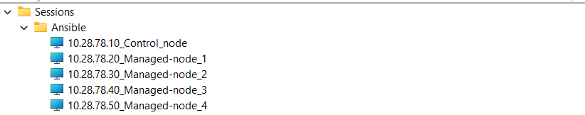

# Ansible Tutorial: Lab Setup for Beginners  

Welcome to this step-by-step **Ansible tutorial**! This guide will help you set up a lab environment to learn and practice **Ansible configuration management**. By the end of this tutorial, you'll have a fully functional Ansible control node and managed nodes within a virtualized network.  

---

## 📋 Prerequisites  

Before we begin, ensure the following requirements are met:  
1. A system to create virtual machines (e.g., **VMware vCenter**, VirtualBox, AWS, or other platforms). 
2. Basic knowledge of networking and Linux commands.  
3. Ansible installed on the **control node** (we'll guide you through this).  

---

## 🖥️ Lab Architecture  

In this lab, we will create:  
- **1 Control Node**: Responsible for pushing configurations using Ansible.  
- **4 Managed Nodes**: Nodes where configurations will be applied.  

All virtual machines will be within the **same reachable network** to ensure Ansible can communicate over SSH.  

[Lab Architecture Diagram](#)   
---

## ⚙️ Setting Up the Lab  

### Step 1: Create Virtual Machines  
1. Using **VMware vCenter** or any platform of your choice to create 5 virtual machines.
I am using VMware vCenter to create the five virtual machines required to setup the lab. You can create VMs anywhere or also can use physical machines as per your convenience.
   

I have installed (Ubuntu 20.04) for both control node and managed nodes. I cloned the master node into four more VMs after OS installation and renamed it as Master and Managed Nodes. 

After that, I used the same subnet of network for all the VMs to ensure the connectivity and configured manually in all system as follows. 

In, Ubuntu 20.02 , I configured static IP from interfaces file located in /etc/network/interfaces.
```bash
   vi /etc/network/interfaces
```
I assigned the following IP addresses, 
#### Control Node: 10.28.78.10, user: root
#### Managed Node: 10.28.78.20, 10.28.78.30, 10.28.78.40, 10.28.78.50,  user: root
My VM has a single interface and configured as follow. Please replace the IP of your network in address, netmask, gateway and dns-nameservers for the proper configuration. 
```bash
auto lo
iface lo inet loopback
auto eth0
iface eth0 inet static
address 10.28.78.10
netmask 255.255.255.0
gateway 10.28.78.1
dns-nameservers 103.69.124.10 103.69.126.10
```
   - **Control Node**: Install a Linux distribution (e.g., Ubuntu 20.04).  
   - **Managed Nodes**: Install the same or different Linux distributions based on your requirements.  
2. Assign static IP addresses or configure a DHCP server to ensure the nodes are within the same network or could be in different network but can communicate with each other. 
3. Verify connectivity by pinging each node from the control node.  

### Step 2: Configure the Control Node  
1. Install **Ansible** on the control node:  
   ```bash
   sudo apt update
   sudo apt install ansible -y

2. Verify the installation. 
   ```bash
   ansible --version

### Step 3: Set Up SSH Keys for Passwordless Authentication
  To allow Ansible to communicate with managed nodes securely, we will set up SSH keys:
1. Generate SSH Key pair on the control Node. 
   ```bash
   ssh-keygen -t rsa -b 4096

Press Enter to accept the default file path (e.g., ~/.ssh/id_rsa).
Optionally, provide a passphrase for added security.

2. Copy the Public Key to Each Managed Node:
Distribute the public SSH key to all managed nodes:
   ``` bash
   ssh-copy-id user@<managed_node_ip>
   ```
Replace user with the username and <managed_node_ip> with the IP address of the managed node. Repeat this for each node.


### Step 4: Verify the password less authentication

All the managed nodes should be accessbile to ssh form the control node. 


verify similarly for all the nodes and our lab is ready to start. 